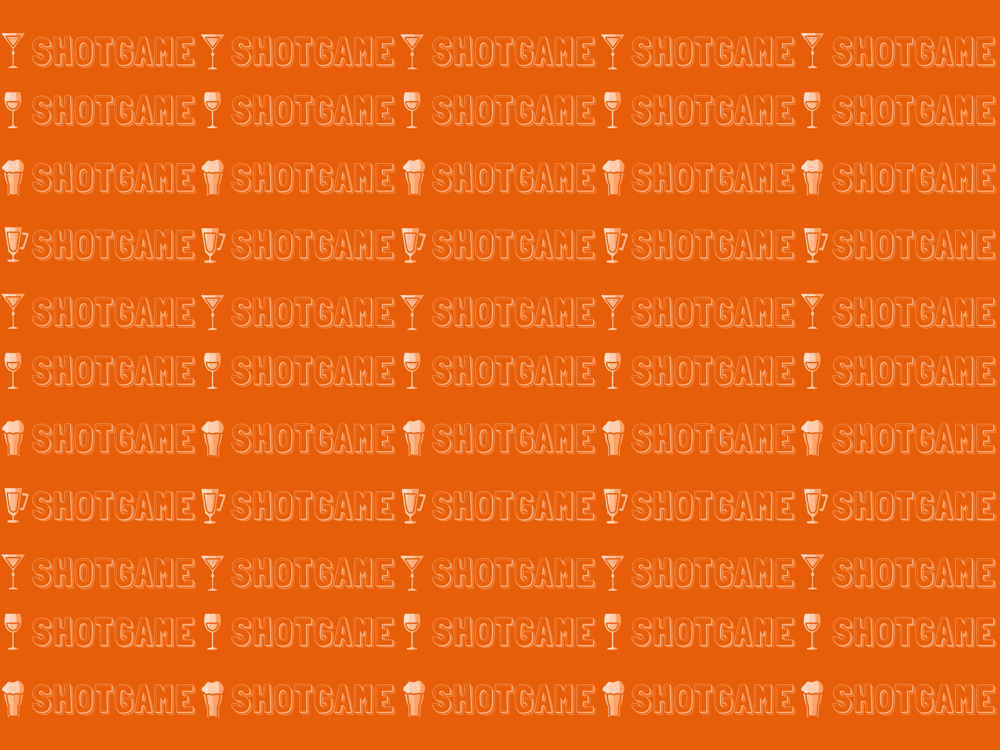

<h1 align="center"> SHOTGAME </h1>

Jogo desenvolvido como forma de estudo e desevolvimento das tecnologias de HTML, CSS e JavaScript.

  <a href="#-tecnologias">Tecnologias</a>&nbsp;&nbsp;&nbsp;|&nbsp;&nbsp;&nbsp;
  <a href="#-projeto">Projeto</a>&nbsp;&nbsp;&nbsp;|&nbsp;&nbsp;&nbsp;
  <a href="#-layout">Layout</a>

 

  

## 🚀 Tecnologias

Esse projeto foi desenvolvido com as seguintes tecnologias:

- HTML e CSS
- JavaScript
- Git e Github

## 💻 Projeto

O Shotgame é um projeto resultado da aplicação dos estudos em HTML e CSS unidos ao meu conhecimento no canva.

## 🔖 Layout

Você pode visualizar o layout do projeto através [DESSE LINK](https://www.canva.com/design/DAFQnig2kCI/FyvZbxjMwV9teR7c7jYi6Q/view?utm_content=DAFQnig2kCI&utm_campaign=designshare&utm_medium=link&utm_source=publishsharelink).

